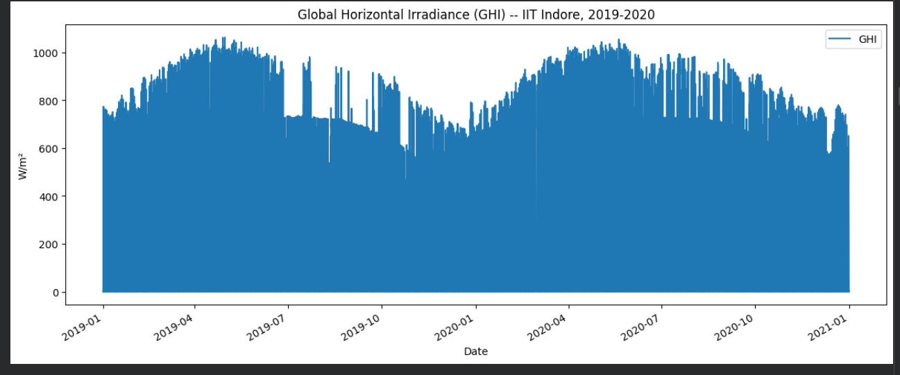
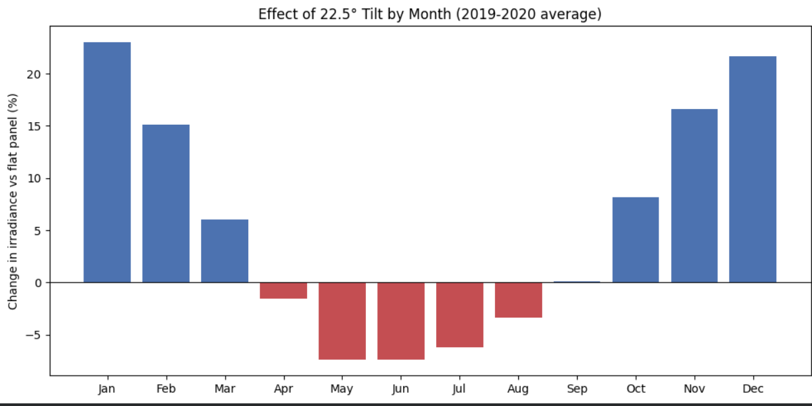
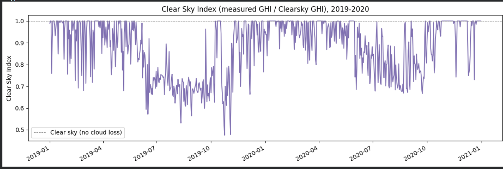
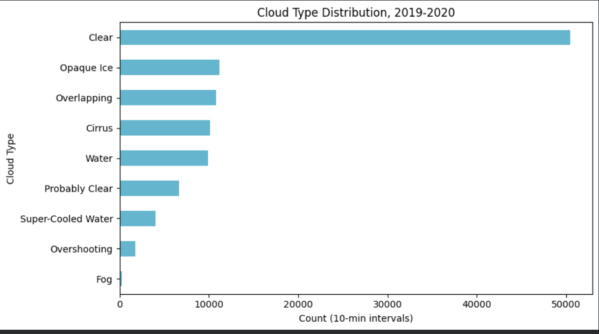
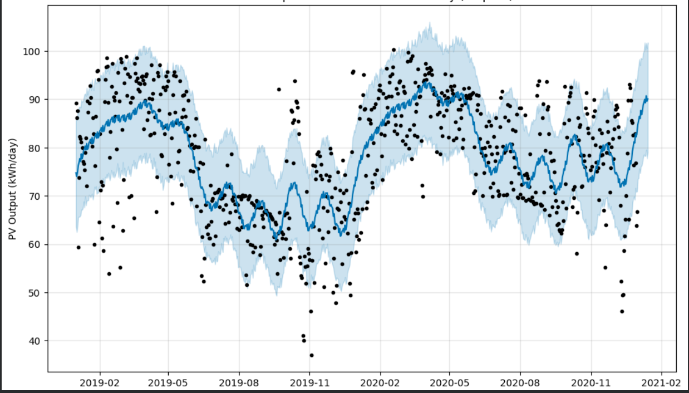
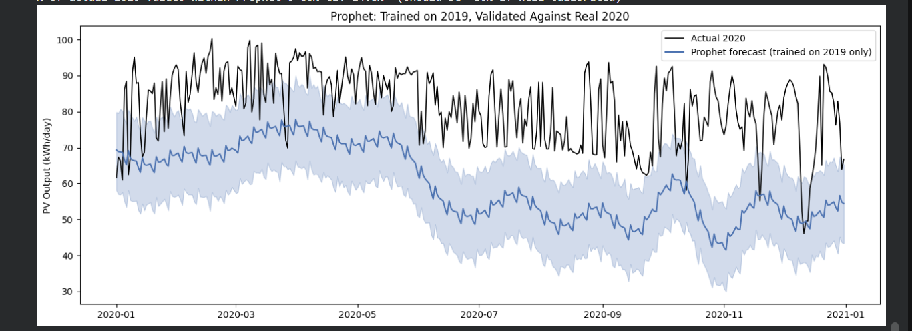

# Solar PV Forecasting Using Satellite Data & ML

Forecasts photovoltaic (PV) solar system output using **2 years of
real satellite-derived irradiance data (2019-2020)**, a physics-based
PV generation model (with tilt and temperature corrections), and
Prophet time-series forecasting — with an interactive Streamlit
dashboard for exploring your own data.

## What this project demonstrates

- Pulling and processing real satellite solar-resource data (NLR/NREL
  Himawari NSRDB API)
- A physics-based PV output model: flat panel → temperature-derated →
  tilt-corrected → combined
- Real astronomical calculations (solar position, tilt geometry),
  validated against the dataset's own measured Solar Zenith Angle
  before being trusted
- Time-series forecasting (Prophet) applied to a physical/engineering
  signal, including a genuine held-out-year validation
- An interactive dashboard where someone can upload their own data and
  get a live forecast

## Motivation

Accuracy claims built on just 1 year of solar data can be misleading.
This project uses 2 full years specifically because 1 year isn't
enough to reliably estimate yearly seasonality (Prophet's own
diagnostic — needs ~730 days) or to know whether a given year's
monsoon was typical. Both turned out to matter a lot (see Results).

## Dataset

[NLR Himawari NSRDB](https://developer.nlr.gov/signup/) — 2 full years
(2019, 2020) of real satellite data for IIT Indore, 105,120 rows at
10-minute resolution (leap day excluded, keeping both years a clean
365 days for the astronomy calculations).

| Column | Description |
|---|---|
| `Year`, `Month`, `Day`, `Hour`, `Minute` | timestamp components (10-min interval) |
| `GHI` | Global Horizontal Irradiance (W/m²) |
| `Temperature` | ambient air temperature (°C) |
| `DNI`, `DHI` | direct beam / diffuse sky irradiance — used for the tilt correction |
| `Surface Albedo` | real measured ground reflectance — used for the tilt correction's reflected component |
| `Solar Zenith Angle` | used to validate our own computed solar position |
| `Clearsky GHI` | modeled cloud-free irradiance — used for the Clear Sky Index |
| `Fill Flag` | data-quality flag — used to check interpolation rate by season |
| `Cloud Type` | categorical cloud classification — charted for context |

**The raw CSVs aren't in this repo** — download your own from the link
above (see Setup) and place at `data/`.

## Setup

1. Get a free API key from the [NLR Developer Portal](https://developer.nlr.gov/signup/)
2. Set it as environment variables — **never hardcode them in the
   notebook or commit them to the repo**:
   ```bash
   export NREL_API_KEY="your_key_here"
   export NREL_EMAIL="your_real_email@example.com"
   ```
3. Install dependencies:
   ```bash
   pip install -r requirements.txt
   ```

## How to run

**A. Notebook (data fetch, physics model, Prophet forecast):**
```bash
jupyter notebook Solar_PV_Forecasting.ipynb
```
Run cells top to bottom. The first cell downloads 2 years of Himawari
GHI/temperature data (`"names": "2019,2020"`) for the configured
location (edit the `wkt` coordinate for your own location).

**B. Interactive dashboard:**

*Recommended — local terminal (clean, no proxy involved):*
```bash
pip install streamlit prophet pandas matplotlib
streamlit run app.py
```
Opens automatically at `http://localhost:8501`.

*Alternative — Google Colab (no local Python install needed):*
```python
!pip install streamlit prophet pandas matplotlib -q
!streamlit run app.py &>/content/logs.txt &
!npx --yes localtunnel --port 8501
```
This prints a public URL (`https://xxxx.loca.lt`). Opening it shows an
interstitial page asking for a password — that's just the Colab VM's
public IP, printed by running `!wget -q -O - ipv4.icanhazip.com` in
another cell. Note: the tunnel occasionally fails to load some of
Streamlit's own CSS/JS assets (shows as red error boxes in the UI) —
this is a known quirk of proxying Streamlit through `localtunnel`, not
a bug in the app itself; the underlying computation still runs
correctly even when this happens. A hard refresh usually clears it.
The local-terminal method above doesn't have this issue.

Either way, upload a Himawari-format CSV and adjust panel area /
efficiency / derating interactively to see the physics model and
Prophet forecast update live.

## What's actually being calculated

**1. Solar irradiance → raw power potential.** GHI (Global Horizontal
Irradiance, in W/m²) is the total solar power hitting one square meter
of horizontal surface at a given moment.

**2. GHI → PV system output (the physics model):**
```
PV Output (kW) = GHI × panel_area × num_panels × efficiency × derating_factor / 1000
```
`derating_factor` (0.85) is a standard industry catch-all for
real-world losses a flat GHI→power conversion would otherwise ignore:
wiring resistance, inverter conversion loss, panel soiling, and small
mismatches between panels in a string.

**3. Temperature :**
```
T_cell = ambient_temperature + (irradiance / 800) × 20      # simplified NOCT-style estimate
efficiency_adjusted = base_efficiency × (1 - 0.004 × (T_cell - 25))
```
Panels are rated at Standard Test Conditions (25°C); real cell
temperature runs hotter than ambient air under strong sun, and silicon
panels lose roughly 0.4% efficiency per °C above 25°C.

**4. Tilt  (Plane-of-Array irradiance).** Real installations
are tilted, typically at the site's latitude, to maximize annual
output:
```
cos(θ) = cos(δ)·cos(φ-β)·cos(ω) + sin(δ)·sin(φ-β)      [angle of incidence, south-facing panel]
Beam    = DNI × cos(θ)
Diffuse = DHI × (1 + cos(β)) / 2                        [isotropic sky model]
Reflected = GHI × albedo × (1 - cos(β)) / 2
POA = Beam + Diffuse + Reflected
```
where δ = solar declination, φ = latitude, β = tilt angle (= latitude
here), ω = hour angle. **Before trusting this geometry**, our own
computed solar position was checked against the dataset's actual
*measured* Solar Zenith Angle — mean error 1.46°, confirming the
underlying astronomy is correct.

**5. Combined model.** Tilt and temperature are combined consistently
— the temperature estimate uses POA (irradiance actually hitting the
tilted panel), not flat GHI, since that's what's physically heating
this specific panel. This is the single most realistic output series,
and what gets forecast.

**6. Clearness Index & Clear Sky Index.** `H_0` (theoretical
no-atmosphere irradiance, computable from date and latitude alone) and
`Clearsky GHI` (NLR's cloud-free-atmosphere model) both give ways to
isolate atmospheric/cloud impact from measured GHI — two independent
cross-checks on the same monsoon signal.

**7. Forecasting (Prophet).** Daily combined output is decomposed into
trend + yearly seasonality and projected forward.

## Results (real data — IIT Indore, 2019-2020)

| Metric | Value |
|---|---|
| Annual mean GHI | 233.7 W/m² |
| Peak GHI | 1,062 W/m² |
| Flat-panel output (2-yr total) | 60,139 kWh |
| Tilted-panel output (2-yr total) | 62,570 kWh (**+4.04%**) |
| Temperature-adjusted output (2-yr total) | 54,788 kWh (**−8.90%**) |
| **Combined (tilt + temperature), 2-yr total** | **56,918 kWh (−5.36%)** |
| 2019 combined annual | 27,242 kWh |
| 2020 combined annual | 29,676 kWh |



The monsoon season is visible in both years — but not equally severe,
which turns out to matter a lot (see below).

### Tilt correction — consistent with a near-equatorial site



Tilting helps enormously in winter (**+23% in January**) and slightly
*hurts* at the summer peak (**−7.4% in May**), averaged across both
years — the sun sits nearly overhead at Indore's latitude in summer,
so tilting the panel actually points it away from directly-overhead
sun.

### Clear Sky Index — isolating cloud impact



2-year mean 0.877 (vs 1.0 = perfectly clear); drops to 0.72–0.78 in
monsoon months (Jun–Sep), confirming the same atmospheric attenuation
visible in the raw GHI chart, isolated specifically from routine
(non-cloud) atmospheric effects.

### Data quality: Fill Flag

24.8% of all readings are interpolated rather than directly measured,
jumping to **43–51% during monsoon** (Jun–Sep) vs single digits in the
dry season — heavy cloud cover makes satellite retrieval harder.
Doesn't invalidate the monsoon findings, but it's an honest caveat:
exactly the season driving those conclusions has the most estimated
data.



### Forecast with Prophet (trained on 2 full years)



With 730 days of history, Prophet's yearly seasonality warning is
**gone** — the model has enough data to reliably separate trend from
seasonal pattern, unlike the single-year attempt earlier in
development.

### Why 2 years matters — a genuine held-out-year test

Trained Prophet on **2019 only**, then checked its forecast against
what **actually happened in 2020** — data it never saw:

*(Note: `weekly_seasonality=False` is set explicitly throughout this
project — Prophet auto-detects a weekly pattern by default, but solar
irradiance has no real day-of-week effect. Disabling it materially
improved this holdout test: MAE dropped from 21.70 to 18.18 kWh and CI
calibration improved from 14.5% to 23.0%, since the model was no
longer fitting noise to a pattern that doesn't physically exist.)*


| Metric | Value |
|---|---|
| MAE | 18.18 kWh |
| RMSE | 20.24 kWh |
| MAPE | 22.0% |
| % of actual 2020 values within Prophet's 80% CI | **23.0%** (should be ~80% if well-calibrated) |



**This is a real, important finding, not a model failure.** 2020's
actual output ran well above what a 2019-only model predicted,
especially through monsoon:

| | 2019 | 2020 | Difference |
|---|---|---|---|
| Monsoon (Jun-Sep) mean daily output | 67.3 kWh | 76.8 kWh | **+14.2%** |
| Full-year mean daily output | 74.6 kWh | 81.3 kWh | +9.0% |

India's monsoon intensity genuinely varies year to year — this is
real climate variability, confirmed independently by the raw data, not
a data error. A model trained on only one year's monsoon severity has
no way to know whether the next year's will be similar, which is
exactly why the confidence interval above is so poorly calibrated:
Prophet was honestly uncertain, and one training year undersold how
uncertain it should have been. **This is the single strongest argument
in this whole project for why multiple years of history matter** —
not just for Prophet's internal math to be "identified," but because
next year's weather genuinely isn't fully predictable from this year's
alone.

## Using the rest of the dataset

Beyond the columns above, the remaining ones (Aerosol Optical Depth,
Ozone, Precipitable Water, Alpha, Asymmetry, Pressure) are
atmospheric-composition inputs NLR already used internally to compute
Clearsky GHI/DNI/DHI — using them again directly wouldn't add new
information.

## Known limitations

- The temperature-derating step uses a simplified NOCT-style cell
  temperature estimate, not a full thermal model
- The tilt model uses the isotropic sky diffuse model (simplest
  standard transposition model); more advanced models (e.g. Perez)
  would be slightly more accurate
- Even with 2 years, Prophet's confidence interval was poorly
  calibrated against the held-out 2020 monsoon — genuine year-to-year
  climate variability is larger than 2 years of history can fully
  capture; more years would further improve this
- An LSTM model was explored during development but isn't included
  here in working form — noted as a future direction, not a current
  feature
- The dashboard assumes the uploaded CSV matches the Himawari export
  format exactly; other solar datasets would need a different parsing
  step
- Panel azimuth is assumed exactly due south (optimal for a
  northern-hemisphere site) — a real installation's actual orientation
  may differ

## Repository contents

```
Solar_PV_Forecasting.ipynb      -- full pipeline: fetch, physics model, tilt/temp corrections, Prophet forecast, holdout validation
app.py                          -- standalone Streamlit dashboard
requirements.txt
ghi_2yr.png                     -- raw GHI, 2019-2020
tilt_effect_2yr.png             -- tilt benefit by month
clear_sky_index_2yr.png         -- cloud-impact diagnostic
cloud_type_2yr.png              -- cloud type distribution
prophet_2yr_main_forecast.png   -- main forecast, trained on 2 full years
prophet_holdout_2019_2020.png   -- held-out-year validation (train 2019, test 2020)
README.md                       -- this file
```

## Future improvements

- Add a working LSTM model as a second forecasting approach to compare
  against Prophet
- Validate the physics model against a real inverter's logged output,
  not just satellite-derived theoretical generation
- Pull additional years — the held-out-year test above suggests more
  history would meaningfully improve forecast calibration
- Support additional data formats beyond the NLR Himawari export
- Deploy the dashboard as a live hosted service
