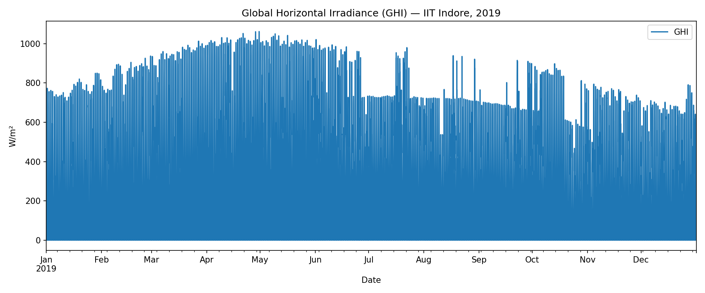
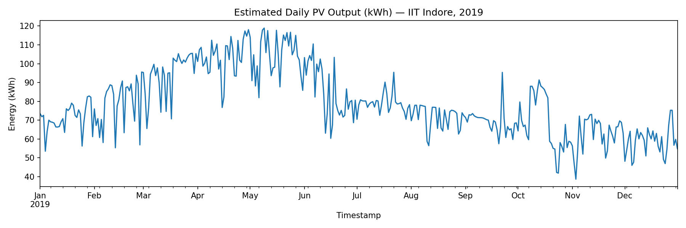
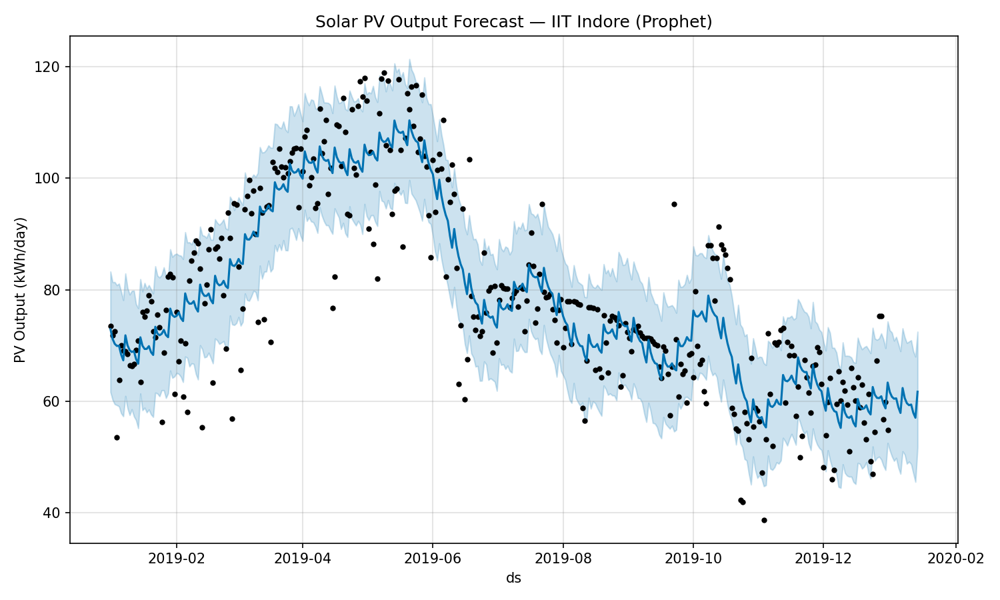

# Solar PV Forecasting Using Satellite Data & ML

Forecasts photovoltaic (PV) solar system output using real
satellite-derived irradiance data, a physics-based PV generation
model, and Prophet time-series forecasting — with an interactive
Streamlit dashboard for exploring your own data.

## What this project demonstrates

- Pulling and processing real satellite solar-resource data (NREL
  Himawari NSRDB API)
- A physics-based PV output model (GHI → power, with a
  temperature-derating refinement)
- Time-series forecasting (Prophet) applied to a physical/engineering
  signal rather than a typical business metric
- An interactive dashboard where someone can upload their own data and
  get a live forecast

## Project structure

```
Solar_PV_Forecasting.ipynb   
app.py                        
README.md
```

## Setup

1. Get a free API key from the [NLR Developer Portal](https://developer.nlr.gov/signup/)
2. Set it as an environment variable — **never hardcode it in the
   notebook or commit it to the repo**:
   ```bash
   export NREL_API_KEY="your_key_here"   # macOS/Linux
   setx NREL_API_KEY "your_key_here"     # Windows (open a new terminal after)
   ```
3. Install dependencies:
   ```bash
   pip install -r requirements.txt
   ```

## How to run

**A. Notebook (data fetch, physics model, Prophet forecast):**
```bash
jupyter notebook Solar_PV_Forecasting.ipynb
```
Run cells top to bottom. The first cell downloads a year of Himawari
GHI/temperature data for the configured location (edit the `wkt`
coordinate in that cell for your own location).

**B. Interactive dashboard:**

*Recommended — local terminal (clean, no proxy involved):*
```bash
pip install streamlit prophet pandas matplotlib
streamlit run app.py
```
Opens automatically at `http://localhost:8501`.

*Alternative — Google Colab (no local Python install needed):*
```python
!pip install streamlit prophet pandas matplotlib -q
!streamlit run app.py &>/content/logs.txt &
!npx --yes localtunnel --port 8501
```
This prints a public URL (`https://xxxx.loca.lt`). Opening it shows an
interstitial page asking for a password — that's just the Colab VM's
public IP, printed by running `!wget -q -O - ipv4.icanhazip.com` in
another cell. Note: the tunnel occasionally fails to load some of
Streamlit's own CSS/JS assets (shows as red error boxes in the UI) —
this is a known quirk of proxying Streamlit through `localtunnel`, not
a bug in the app itself; the underlying computation still runs
correctly even when this happens. A hard refresh usually clears it.
The local-terminal method above doesn't have this issue.

Either way, upload a Himawari-format CSV (same format the notebook
downloads) and adjust panel area / efficiency / derating interactively
to see the physics model and Prophet forecast update live.

## Verified working

Every stage of the pipeline — data fetch, timestamp reconstruction,
the physics model, the temperature-derated model, and the Prophet
forecast — has been run end-to-end against **real NLR Himawari
satellite data** for IIT Indore, 2019 (see Results below). This isn't
a synthetic demo; the numbers below came from an actual API pull and
an actual model run.

## What's actually being calculated

**1. Solar irradiance → raw power potential.** GHI (Global Horizontal
Irradiance, in W/m²) is the total solar power hitting one square meter
of horizontal surface at a given moment — this is the raw input every
downstream number is built from.

**2. GHI → PV system output (the physics model):**
```
PV Output (kW) = GHI × panel_area × num_panels × efficiency × derating_factor / 1000
```
Worked example, at the annual-mean GHI of 224.2 W/m² for this system
(10 panels × 1.6 m² × 18% efficiency × 0.85 derating):
```
224.2 × 1.6 × 10 × 0.18 × 0.85 / 1000 ≈ 0.549 kW average instantaneous output
```
Summing that across every 10-minute interval in a day, then every day
in the year, gives the 28,843 kWh annual total in the Results below.
`derating_factor` (0.85) isn't a physics constant — it's a standard
industry catch-all for real-world losses a flat GHI→power conversion
would otherwise ignore: wiring resistance, inverter conversion loss,
panel soiling, and small mismatches between panels in a string.

**3. Temperature correction (why the same GHI can produce less power
on a hot day):**
```
T_cell = ambient_temperature + (GHI / 800) × 20      # simplified NOCT-style estimate
efficiency_adjusted = base_efficiency × (1 - 0.004 × (T_cell - 25))
```
Panels are rated at Standard Test Conditions (STC), which assumes
25°C. Real cell temperature runs hotter than ambient air temperature
under strong sun — the `(GHI/800)×20` term approximates that heating
effect. Silicon panels lose roughly 0.4% efficiency per °C above 25°C,
so on a 46°C day with strong sun, cell temperature can exceed 60°C,
compounding into a real, measurable output loss — 8.8% annually for
this dataset (see Results).

**4. Daily/annual energy totals.** Instantaneous kW readings are
resampled and summed per calendar day (kWh = kW integrated over time,
and at 10-minute intervals summing kW values approximates that
integral), then summed again across all 365 days for the annual total.

**5. Forecasting future output (Prophet).** The daily energy series is
fed to Facebook Prophet, which decomposes it into a trend component
plus a yearly seasonal component, then projects both forward — this is
what produces the shaded confidence band and the 14-day-ahead forecast
in the Results below.

## Results (real data — IIT Indore, 2019)

This pipeline was run end-to-end against real NLR/NREL Himawari satellite
data for IIT Indore's campus (`POINT(75.9235 22.5297)`), full year 2019,
10-minute resolution:

| Metric | Value |
|---|---|
| Annual mean GHI | 224.2 W/m² |
| Peak GHI | 1,062 W/m² |
| Base model annual PV output (10 × 1.6m² panels, 18% eff.) | 28,843 kWh |
| Temperature-adjusted annual output | 26,292 kWh |
| Loss from temperature derating | 2,551 kWh (**8.8%**) |

**A real, location-specific finding:** Indore's climate (mean temp
25.8°C, peaks to 46.6°C) causes a meaningfully larger temperature
derating loss than a cooler climate would — the 8.8% annual reduction
directly reflects how much hot-climate PV installations lose purely to
heat, something a flat-efficiency model would completely miss.



The monsoon season (June–September) is visibly identifiable as a
sustained drop in peak daily irradiance — real cloud cover impact, not
noise.



Output peaks in April–May (pre-monsoon, clearest skies) and dips
through the monsoon before a partial recovery and winter decline.



Prophet's fit tracks the seasonal curve well, including the sharp
May→June transition into monsoon — though as noted below, the
confidence band is wide since only one year of history was available.

## Data format

NREL's Himawari export has a 2-line metadata header, then:

| Column | Description |
|---|---|
| `Year`, `Month`, `Day`, `Hour`, `Minute` | timestamp components (10-min interval) |
| `GHI` | Global Horizontal Irradiance (W/m²) |
| `Temperature` | ambient air temperature (°C) |

Both the notebook and the dashboard reconstruct a single `Timestamp`
index from the five date/time columns before doing anything else.

## Known limitations

- The temperature-derating step uses a simplified NOCT-style cell
  temperature estimate, not a full thermal model
- Prophet's yearly seasonality needs roughly 2 years of history to fit
  reliably — with only 1 year, Prophet will warn (not error) that the
  seasonal decomposition may be unstable
- An LSTM model was explored during development but isn't included
  here in working form — noted as a future direction, not a current
  feature
- The dashboard assumes the uploaded CSV matches the Himawari export
  format exactly; other solar datasets would need a different parsing
  step

## Future improvements

- Add a working LSTM model as a second forecasting approach to compare
  against Prophet
- Validate the physics model against a real inverter's logged output,
  not just satellite-derived theoretical generation
- Support additional data formats beyond the NREL Himawari export
- Deploy the dashboard as a live hosted service
